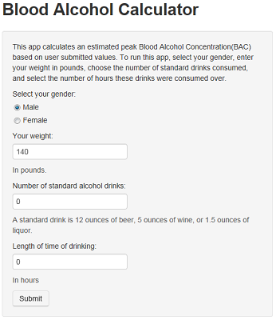

## Why a BAC calculator

Whether someone is a casual drinker or a heavy drinker, it is useful to know what the Blood Alcohol Concentration (BAC) might be when drinking for several reasons.

- Knowing the level of intoxication can promote safer behaviors
- Regardless of how inoxicated someone feels, the actual BAC determines the impact on their health
- Different people would have different BACs even if they have the same number of drinks

--- 

## Factors affecting BAC

There are four main factors that determine what someone's BAC might be.

1. The amount of alcohol consumed
2. The rate of consumption
3. The drinker's body mass
4. The sex of the drinker

--- &twocol w1:50% w2:50%

## Same drinks, different BACs

Despite having the same number of drinks over the same amount of time, these two drinkers end up with different BACs.

*** {name: left}

```{r bac-calculations1}
drinks <- 10
hours <- 10
weight1 <- 160
genderadjustment1 <- .58

bac1 <- round(((.806 * drinks * 1.2)/
        (weight1 * .453592 * genderadjustment1)) - 
        (.017 * hours),2)
bac1
```

*** {name: right}

```{r bac-calculations2}
weight2 <- 120
genderadjustment2 <- .49

bac2 <- round(((.806 * drinks * 1.2)/
        (weight2 * .453592 * genderadjustment2)) - 
        (.017 * hours),2)
bac2
```

--- &twocol w1:50% w2:50%

## The BAC Calculator App


*** {name: left}



*** {name: right}

### Why use this app?

- Easy interface
- As seen earlier, different drinkers would have different BACs
- Also calculates the time to sober up.